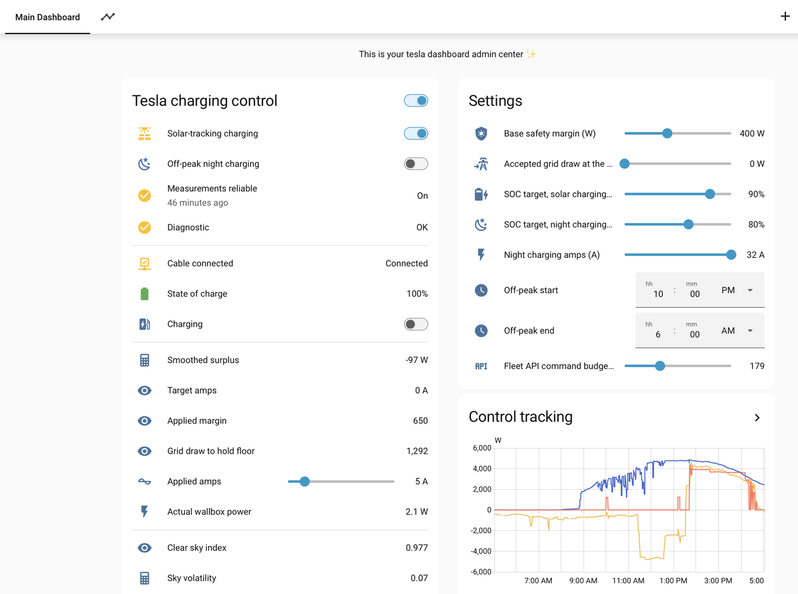
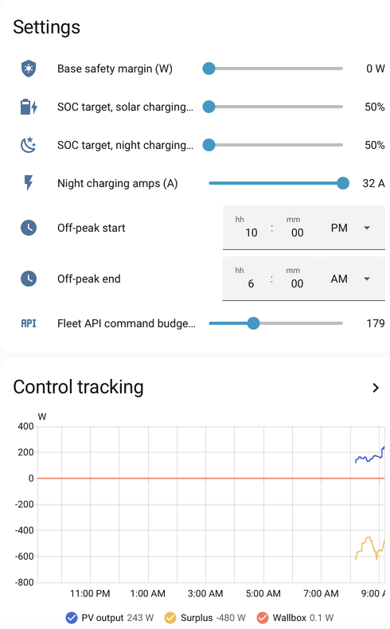

# Tesla solar surplus charging for Home Assistant

A Home Assistant package that charges a Tesla from photovoltaic surplus during
the day and on off-peak tariff at night, controlling the car directly through
the official Tesla Fleet integration.

No custom component, no container, no extra service. One YAML file.

## Why this exists

Several mature projects already solve solar surplus charging — [evcc](https://evcc.io),
[PV Excess Control](https://github.com/InventoCasa/ha-advanced-blueprints),
[Solar Optimizer](https://github.com/jmcollin78/solar_optimizer), and
[EMHASS](https://emhass.readthedocs.io) for predictive optimisation. If your
wallbox is locally controllable, use one of those instead.

This package targets a narrower situation:

- a **dumb wallbox** with no network control, so the car itself is the actuator
- the **Tesla Fleet API** as the only control path, which is rate limited and
  billed past a free tier
- a **cloud-dependent energy meter** that can go unavailable, or worse, freeze
  on a plausible-looking value

Those three constraints shape the whole design and are what the existing
projects do not address.

## How it works

Three independent layers.

**Measure.** Surplus is `wallbox_power - net_grid_power`. The car's current
draw is added back because what the car already pulls is part of what is
available; without this the controller collapses to zero the moment it reaches
equilibrium. The result is averaged over 3 minutes.

**Decide.** Surplus is converted to amps using measured mains voltage. A safety
margin is subtracted, and that margin widens when the sky is unstable. Sky
stability is measured by comparing actual PV output against the Solcast 90th
percentile forecast for the current half-hour slot — a free proxy for clear-sky
output — and taking the standard deviation of that ratio over 15 minutes.

**Act.** Commands go to the car with an asymmetric dead band:

| Direction | Threshold | Pacing | Rationale |
|---|---|---|---|
| Down | 1 A | interval ÷ 2, floor 30 s | every minute of delay is paid in grid import |
| Up | 2 A | full interval | waiting costs a few hundred watts; rushing costs API budget, often for nothing |

The interval is not fixed. The remaining command budget is spread over the
remaining daylight, so tracking is fine in the morning and automatically
coarsens if the budget runs low.

### Guard rails

**Measurement sanity.** Control freezes entirely if any meter goes unavailable,
if readings stop refreshing for 5 minutes, or if PV output reads zero while the
sun is up. On a freeze the amperage is held rather than reset — if the cause is
a mains outage the wallbox has no power anyway, and if it is a metering fault
holding is safer than steering on bad data.

**Loop check.** The wallbox clamp is compared against the commanded amperage
every 10 minutes. Teslas sometimes cap themselves or silently ignore a command;
without this check the controller would be steering into the void.

**Night isolation.** The off-peak logic reads no measurement at all — time, SOC,
fixed amperage. A meter outage in January must not stop you charging. It also
resets the car to full amperage on start, since the solar controller has very
likely left it at 6 A at the end of the day.

## Dashboard

The card in `dashboard/tesla_solar_card.yaml` is organised around the three
gaps that matter, in reading order: what the controller sees, what it commands,
and what the car actually does.

| Control | Settings and tracking |
|---|---|
|  |  |

`Smoothed surplus` negative means the house is importing — target amps
correctly falls to zero. `Clear sky index` around 0.43 indicates hazy
conditions, and `Sky volatility` at 0.06 is just above the first threshold, so
a 250 W margin is applied on top of the base margin.

`Min interval between commands` is derived, not configured: the remaining API
budget spread over the remaining daylight.

The history graph is the real tuning instrument. If the wallbox trace follows
the surplus with acceptable lag and no sawtooth, the controller is well tuned.

## Requirements

**Required**

- Home Assistant with YAML packages enabled
- Official **Tesla Fleet** integration, including virtual key pairing
  (without it, sensors work but commands do not)
- A power meter giving net grid flow, signed
- A power meter on the wallbox circuit
- At least one PV production meter — a single array, or an inverter total

**Optional**

| Missing | What you lose | What still works |
|---|---|---|
| Second PV array meter | string imbalance sensor | everything else |
| Mains voltage sensor | ~4% accuracy on the amps calculation | everything else |
| Solcast | dynamic margin, clear-sky index | everything else |

Set an optional entity to the literal word `none` in the package if you do not
have it. The total PV sensor falls back to the single array, the imbalance
sensor turns `unavailable` rather than reporting a meaningless figure, and the
measurement guard stops requiring a meter that was never there.

Two failures are not survivable and are worth naming: losing the **net grid
meter** disables all solar control, and losing any **Tesla entity** disables
everything. Night charging survives both, since it reads no measurement at
all — which is the point of keeping it separate.

## Installation

Copy `packages/tesla_solar.yaml` into `config/packages/`, then enable packages
in `configuration.yaml`:

```yaml
homeassistant:
  packages: !include_dir_named packages
```

Restart Home Assistant. A reload is not enough on first install — the counter,
input_datetime and input_boolean helpers need a full start.

## Adapting to your setup

Every external entity is listed in the `ADAPT THIS` block at the top of the
package file. Home Assistant has no variable mechanism that works both in YAML
fields and inside Jinja strings, so adaptation is a plain find-and-replace.

| Purpose | Default entity | | Notes |
|---|---|---|---|
| Net grid power | `sensor.vue_totalusage_1min` | required | positive = import |
| Wallbox power | `sensor.borne_ve_2_1min` | required | |
| PV array 1 | `sensor.solar_panels_1_1min` | required | SW, 2800 Wp |
| PV array 2 | `sensor.solar_panels_se_8_1min` | optional | SE, 3300 Wp |
| Mains voltage | `sensor.myups_input_voltage` | optional | falls back to 230 V |
| Charging amps | `number.model_y_charge_current` | required | |
| Charge switch | `switch.model_y_charge` | required | |
| State of charge | `sensor.model_y_battery_level` | required | |
| Cable connected | `binary_sensor.model_y_charge_cable` | required | |
| Solcast today | `sensor.solcast_pv_forecast_forecast_today` | optional | needs `detailedForecast` attribute |
| Solcast next hour | `sensor.solcast_pv_forecast_forecast_next_hour` | optional | kWh |

Optional entities use `has_value()` rather than a `float(0)` default, so an
absent meter is distinguished from one genuinely reading zero. That matters:
with a plain default, a single-array site would silently halve its own total
and the zero-output guard would never fire.

Two site constants are hardcoded in the string imbalance sensor: the peak watts
of each array. The wallbox ceiling (32 A) is hardcoded in the target amps
sensor — do **not** replace it with the entity's `max` attribute, which is only
a leftover from the last session while the cable is unplugged.

## Commissioning

Deploy with both `input_boolean` helpers **off** and observe for two or three
sunny days before handing over control.

Watch `sensor.clear_sky_index` — it should sit around 0.9–1.0 in full sun. If it
stays at 1 regardless of weather, the Solcast wiring is wrong. If it reads 0.3
on a clear day, your Solcast site declaration does not match your actual array.

Watch `sensor.sky_volatility` on a day with drifting cumulus. The thresholds in
the package (0.05 and 0.15) are a starting estimate, not a calibrated value.

Start with `tesla_base_margin` at 400 W and reduce later.

## Tuning

| Symptom | Fix |
|---|---|
| Sawtooth on the wallbox trace | raise `tesla_base_margin` |
| Frequent stop/start in changeable weather | raise base margin, or lengthen the 10-minute stop delay |
| Command budget exhausted by mid-afternoon | raise the up threshold from 2 A to 3 A |
| Budget barely used | lower the up threshold to 1 A for finer tracking |
| Persistent gap between commanded and actual | the wallbox is current-limited; check the Pilot signal rating |

## Known limitations

The command counter is self-imposed, not read from Tesla. Check actual usage on
the Tesla developer portal after a few days.

The measurement guard depends on Solcast only if the optional gate is enabled.
With it enabled, a Solcast outage disables zero-output detection. The
availability and staleness checks keep working either way.

Smoothing plus a one-minute-average meter gives roughly 3–4 minutes of real
latency. Enabling 1-second data on the meter, or flashing it with local
firmware, allows the smoothing window to be cut to 60–90 seconds.

## License

MIT.
